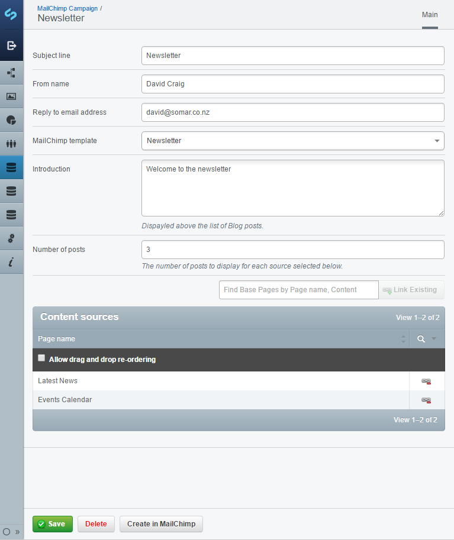

# SilverStripe Chimpify

Generates MailChimp campaigns from SilverStripe blogs.

## Requirements

- SSL is required to communicate with the MailChimp API.

## Documentation

See the [docs folder](docs/en/index.md).

## TODO

- Make the module more generic. Generate content from any DataObject, not just Blogs.
